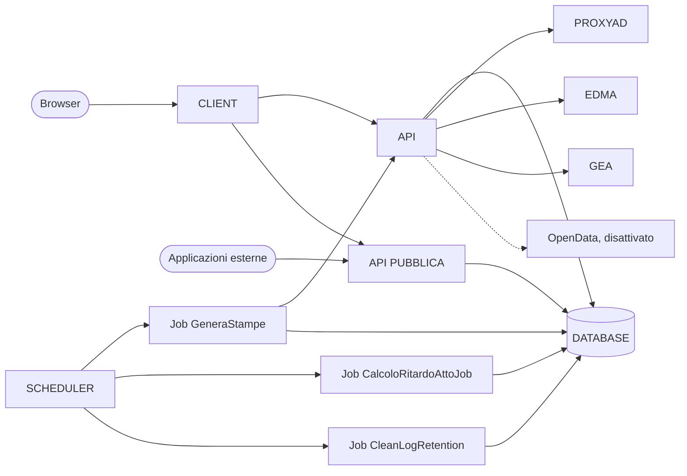

# Portale digitalizzazione atti (GeDASI)

Il progetto GeDASI è il risultato di diverse fasi di sviluppo che hanno portato alla costruzione di uno stack tecnologico, che comprende:
- il modulo PEM, per la presentazione degli Emendamenti ai progetti di legge, nell’ambiente quindi legato a una specifica seduta e attivato in concomitanza della stessa.
- il modulo DASI, per la presentazione e la gestione degli ATTI di indirizzo e sindacato ispettivo, non necessariamente legato a una specifica seduta del Consiglio.

Il portale è stato inizialmente studiato per digitalizzare la presentazione degli emendamenti/subemendamenti ai progetti di legge (modulo PEM) e, a seguito del riscontro positivo da parte degli utilizzatori, è stato esteso alla presentazione degli atti di indirizzo e sindacato ispettivo, realizzando il modulo DASI. In una terza fase il modulo DASI è stato esteso con una serie di funzionalità, dedicate al personale del Servizio Segreteria dell’Assemblea consiliare, che consento di gestire tutte le informazioni correlate agli atti di indirizzo e di sindacato ispettivo (ad esempio date di trattazione, note, ecc) e memorizzare i documenti relativi al fascicolo che compone la vita dell’atto (ad esempio le risposte fornite dalla Giunta in merito ad una interrogazione o interpellanza di un consigliere). A seguito di questa terza fase di sviluppo la piattaforma ha preso il nome di GeDASI.

A differenza degli emendamenti che si concludono con la votazione (approvato/respinto), gli atti di indirizzo e sindacato ispettivo hanno un iter complesso che si sviluppa in una serie di passaggi, da tracciare, e di documenti da generare e memorizzare. 

Per chiarezza espositiva tratteremo separatamente il modulo per la presentazione dematerializzata degli emendamenti (PEM) il modulo per la presentazione dematerializzata degli atti di indirizzo e di sindacato ispettivo (DASI) e il terzo modulo che consente la gestione di questi ultimi.

L’accesso al portale è rimasto comunque unico per tutti i moduli, le varie sezioni sono visibili solo ai profili autorizzati. Il nuovo sviluppo per la gestione degli atti di indirizzo e di sindacato ispettivo è accessibile solo al personale del Servizio Segreteria dell’Assemblea. Va puntualizzato che, per i due canali di accesso, la categoria di utenti non è coincidente: gli assessori, in quanto non sono consiglieri o sono sospesi dalla carica, non accederanno al canale DASI.

## Modulo PEM - Presentazione Emendamenti
  
Gli emendamenti sono proposte di modifica riferite ad uno specifico punto di un progetto di legge (titolo, articolo, comma, allegato, ecc.) prima che questo venga votato dall’assemblea legislativa regionale. I subemendamenti sono invece proposte di modifica riferite ad un emendamento precedentemente presentato. Il Portale PEM aiuta a de-materializzare e informatizzare le procedure del Consiglio Regionale per la presentazione di emendamenti/subemendamenti (EM/SUBEM).

## Modulo DASI – Digitalizzazione Atti di Sindacato ispettivo e d'Indirizzo

Gli atti di indirizzo e di sindacato ispettivo sono atti, tipici della tradizione parlamentare, attraverso i quali il Consiglio esercita la funzione di controllo sull’esecutivo e concorre alla determinazione dell’indirizzo politico (articolo 14, comma 1, dello Statuto d’autonomia).

Gli strumenti di indirizzo politico, denominati ATTI DI INDIRIZZO, previsti dal Regolamento generale sono mozioni, ordini del giorno e risoluzioni:

- La mozione (MOZ) è il tipico strumento assembleare, è uno strumento autonomo e, quanto ai contenuti, non subisce limiti espressi;
- L’ordine del giorno (ODG) è uno strumento accessorio ad altro atto, in genere un progetto di legge; è anche lo strumento tipico con cui l’Aula conclude i dibattiti su un determinato argomento;
- La risoluzione (RIS) è il frutto del dibattito e dell’elaborazione in una Commissione consiliare di un tema specifico a contenuto settoriale e non viene pertanto trattata attraverso questo strumento informatico.

La funzione di controllo invece, come definita a livello parlamentare, si estrinseca (anche) nell’attività di sindacato ispettivo (ATTI DI SINDACATO ISPETTIVO), e viene tradizionalmente esercitata attraverso gli strumenti tipici dell’interpellanza (ITL), dell’interrogazione (ITR) e dell’interrogazione a risposta immediata (IQT).

## Funzionalità di gestione avanzata

Nel suo complesso il GeDASI offre alcuni strumenti avanzati come la ricerca effettuata tramite la configurazione di filtri custom, la gestione massiva e puntuale degli atti. Il sistema è anche in grado di fornire una reportistica basata su una configurazione completamente personalizzata e memorizzabile di:

- criteri di ricerca
- tipo di documento (word, xls e pdf)
- tipo di visualizzazione
- template per le copertine e l'impaginazione
- dati esposti

# Note sul copyright
- Copyright: Consiglio regionale della Lombardia
- Stato del progetto: in esercizio
- Mantenimento in carico Namirial S.p.A. a socio unico - https://www.namirial.it/
- Per segnalare CVE e problemi di sicurezza scrivere a opensource@2Csolution.it (**ATTENZIONE:** utilizzare esclusivamente questo canale per segnalazioni relative alla sicurezza, non utilizzare lo strumento di issue tracking del repository)
 
# Contenuti

- [Introduzione](#introduzione)
- [Struttura del repository](#struttura-del-repository)
- [Struttura del progetto](#struttura-del-progetto)
- [Installazione](#installazione)
  - [Note sulla release](#note-sulla-release)
  - [Requisiti del sistema](#requisiti-del-sistema)
  - [Procedura di installazione](#procedura-di-installazione)
- [Licenza](#licenza)
  - [Autore / Copyright](#autore--copyright)
  - [Licenze dei componenti di terze parti](#licenze-dei-componenti-di-terze-parti)
  - [Dettagli della licenza](#dettagli-della-licenza)

# Introduzione

Questo repository contiene il codice sorgente e la documentazione del portale GeDASI. 
L'obiettivo del Portale è di informatizzare e rendere più efficiente e funzionale la procedura di deposito (numerazione e marcatura temporale) degli emendamenti ai progetti di legge e degli atti di indirizzo e di sindacato ispettivo, con un’applicazione multiutente con livelli di informatizzazione e automazione più o meno ampi, a seconda delle varie fasi del processo. L'applicazione, unica, è stata divisa a livello funzionale in due moduli denominati modulo PEM e modulo DASI.
 
Il Modulo PEM permette di:
- gestire da remoto la predisposizione dei testi degli EM/SUBEM, la firma e l’operazione di deposito;
- garantire autenticità del testo, intesa come integrità del testo, provenienza del documento dal suo autore e certezza temporale sulla sua presentazione;
- snellire le operazioni per la lavorazione degli EM/SUBEM (numerazione, marcatura, autenticazione, ecc…);
- ridurre i tempi necessari alla generazione di output finalizzati alla discussione in aula e alle fasi post-seduta, attraverso la loro generazione automatica;
- agevolare i lavori d'aula: visualizzare, gestire e modificare in Aula il testo degli emendamenti;
- ridurre l’utilizzo della carta e dei supporti per la stampa.

Il Modulo DASI permette di:
- gestire da remoto la predisposizione dei testi degli ATTI, la firma e l’operazione di deposito;
- garantire autenticità del testo, intesa come integrità del testo, provenienza del documento dal suo autore e certezza temporale sulla sua presentazione;
- snellire le operazioni per la lavorazione degli ATTI (numerazione, marcatura, autenticazione, ecc…);
- ridurre l’utilizzo della carta e dei supporti per la stampa.
- gestire massivamente gli atti
- gestire puntualmente i dati associati agli atti
- configurare la ricerca ricorrente degli atti
- customizzare la reportistica

Maggiori dettagli sulle funzionalità possono essere lette nella documentazione per l’utente finale:

- [Documentazione](/Documentazione/README.md)

# Struttura del repository

  All'interno della release, oltre al presente file README.md e al file di licenza LICENSE.md, sono presenti le seguenti cartelle:
  
  - Database: script di creazione e di aggiornamento del database e sua documentazione
  
  - Documentazione: documentazione varia sull'installazione e sull'utilizzo del Portale GeDASI
  
  - Sorgenti API: sorgenti dei moduli API utilizzati dal Portale GeDASI
  
  - Sorgenti API Pubblica: sorgenti dell'API pubblica, un'applicazione Web API separata che espone in sola lettura, senza autenticazione, i dati degli atti di indirizzo e di sindacato ispettivo
  
  - Sorgenti Client: sorgenti della parte client del Portale GeDASI
  
  - Sorgenti Importazione Dati Alfresco: due applicazioni console che importano nel database gli atti e i documenti esportati da Alfresco
  
  - Sorgenti modulo calcolo ritardo: job CalcoloRitardoAttoJob, che calcola i giorni di ritardo nella risposta agli atti
  
  - Sorgenti modulo di stampa asincrona: libreria di generazione dei pdf (PortaleRegione.GestioneStampe) e job GeneraStampe, che produce le stampe in modalità asincrona
  
  - Sorgenti modulo retention: job CleanLogRetention, che cancella dalle tabelle di audit le righe più vecchie del periodo di conservazione
  
  - Sorgenti Scheduler Quartz: servizio Windows che esegue i job pianificati e programma per configurarlo
  
  - tools: script PowerShell per attivare gli hook del repository (setup-hooks.ps1) e per verificare che i file di configurazione locali e i loro template abbiano le stesse chiavi (check-secrets-template.ps1)
  
  - .githooks: hook pre-commit che lancia la verifica dei template
  
Lo sviluppo procede su branch datati, uno per release, ciascuno costruito sul precedente. Il nome riporta la data e la versione della release, con il prefisso `feature/` o `bugfix/` (per esempio `feature/2026.5.1/v2026.5.1` e `bugfix/2026.09.11/v2026.09.11`). A rilascio avvenuto il branch confluisce in master con una pull request.

- Branch master: contiene il codice e la documentazione delle release di GeDASI già confluite

- Branch v2.0-stable: contiene il codice e la documentazione della versione PEM 2.0 ovvero il modulo PEM per la digitalizzazione della presentazione degli emendamenti senza le ultime modifiche evolutive effettuate

# Struttura del progetto

#### INTRODUZIONE

La versione pubblicata del software GeDASI è l’evoluzione di una prima versione di PEM (PEM v 1.0) e della sua successiva, PEM-DASI, sviluppata con tecnologia Microsoft ASP.net su Framework .NET 4.5.
La nuova versione è stata realizzata con l’obiettivo di migliorare e superare alcuni limiti del vecchio portale offrendo i seguenti vantaggi:
-	Eliminazione di librerie di terze parti coperte da licenza non opensource;
-	Separazione della parte client da quella server realizzando API dedicate che gestiscono tutta la logica applicativa di GeDASI e facilitano l'eventuale sviluppo di applicazioni mobile per dispositivi Apple e Android;
-	Aumento della modularità per consentire l’evoluzione del portale per la gestione di altre tipologie di ATTI (es. atti d’indirizzo e di sindacato ispettivo);
-	Miglioramento delle performance soprattutto nella parte di generazione delle stampe;
-	Miglioramento della sicurezza;
-	Introduzione di funzionalità che permetto di utilizzare la piattaforma in modalità stand-alone, gestendo in modalità nativa le funzioni di autenticazione, profilazione e di anagrafica.
 
La nuova versione è stata sviluppata utilizzando la tecnologia Microsoft MVC (model view controller) utilizzando C# come linguaggio di programmazione e .NET Framework, oggi nella versione 4.8.

Successivamente la piattaforma PEM v2.0, utilizzata per digitalizzare gli emendamenti/subemendamenti ai progetti di legge, è stata estesa per la digitalizzazione degli altri atti tipici delle assemblee regionali sviluppando il modulo DASI per la Digitalizzazione Atti di Sindacato ispettivo e d'Indirizzo PEM-DASI v2.2

La piattaforma GeDASI offre un nuovo incremento alle funzionalità del sistema, tra cui:
- filtraggio configurabile
- reportistica custom
- CRUD sul singolo atto
- gestione massiva atti
- gestione dei template per report lettere e copertine

### STRUTTURA DEL SISTEMA
Il portale GeDASI è stato progettato e sviluppato in modo da separare in maniera netta la parte server da quella client e allo stesso tempo fornire interfacce programmabili (API) di tipo web che possono essere richiamate ed utilizzate per altri scopi da altre applicazioni.

Le componenti principali del sistema sono quelle in figura, descritte di seguito:
-	DATABASE:
Motore di database contenente i dati dell’applicazione, le funzioni e le procedure di basso livello. Si è scelto di utilizzare MS Sql Server come DBMS.
-	API:
È la parte core del sistema che contiene tutta la logica applicativa e di interfacciamento ad alto livello, tramite la modellazione di opportune classi, con la base dati di GeDASI. L’interfacciamento con la base dati è stato realizzato utilizzando un layer con EntityFramework 6
-	CLIENT:
È il modulo che interroga l’API e genera l’output finale (html, javascript, css) da inviare ai dispositivi client.
-	API PUBBLICA:
Applicazione separata dall'API che espone in sola lettura, senza autenticazione, i dati degli atti di indirizzo e di sindacato ispettivo (vedere il paragrafo "WebService pubblico"). Il CLIENT la interroga per mostrare la scheda pubblica di un atto.
-	PROXYAD (WEBSERVICES DI AUTENTICAZIONE):
È un servizio web di tipo soap che si occupa di effettuare l’autenticazione e la profilazione degli utenti del sistema interfacciandosi con il repository Active Directory delle utenze di rete del CRL.
-	EDMA (PROTOCOLLAZIONE):
Sistema documentale al quale l'API invia gli atti di indirizzo e di sindacato ispettivo da protocollare: crea la pratica, carica il pdf dell'atto con l'eventuale allegato, lo fascicola nella pratica e ottiene la segnatura di protocollo. Il client dei servizi EDMA è il sotto-progetto SDK.EDMA, il flusso è in `PortaleRegione.BAL/DASIProtocollazioneService.cs`, la configurazione nel file `Edma.config`.
-	GEA (RICERCA ATTI):
Sistema esterno, basato su Alfresco, in cui l'API cerca gli atti; la ricerca è riservata ad Amministratore PEM e Segreteria dell'Assemblea (sotto-progetto SDK.GEA, endpoint CercaAttiGea di ATTICONTROLLER).
-	SCHEDULER E JOB:
Servizio Windows basato su Quartz.NET che esegue periodicamente tre job: GeneraStampe genera le stampe pdf richieste in modalità asincrona e le invia via email al richiedente, CalcoloRitardoAttoJob aggiorna i giorni di ritardo nella risposta agli atti, CleanLogRetention cancella le righe vecchie delle tabelle di audit.

NOTA: 
Il progetto in produzione presso il Consiglio regionale della Lombardia utilizza un ulteriore web service per la pubblicazione dei dati relativi agli emendamenti sul dataset dedicato all’interno del portale www.dati.lombardia.it. Questa funzionalità non è attiva nel sorgente pubblicato e tutte le chiamate al web service sono state disabilitate attraverso l’impostazione della chiave presente nel web.config dell'API (AbilitaOpenData = 0)

### API
Come accennato il modulo API è la parte core della soluzione GeDASI e contiene tutta la logica applicativa e di interfacciamento alla base dati.
L’API dialoga pertanto sia con il modulo client, per l’invio di tutte le informazioni necessarie alla creazione delle pagine web finali, sia con il DBMS per la lettura e la memorizzazione dei dati.
Per l’interfacciamento con il database è stato sviluppato un layer con EntityFramework 6. Questo agevola l’utilizzo anche di altri provider nel caso non si voglia usare Microsoft SQL server. Per tutti i database supportati fare riferimento alla guida [Panoramica di Entity Framework 6 - EF6 | Microsoft Docs](https://docs.microsoft.com/it-it/ef/ef6/)

#### API – AUTENTICAZIONE
Le richieste all’API vengono soddisfatte solo se il richiedente risulta correttamente autenticato ed autorizzato ad accedere alla risorsa/funzionalità richiesta. Per l’autenticazione, l’API fornisce un endpoint (di tipo allow-anonimous) che permette il riconoscimento tramite username e password. In caso di corretta autenticazione viene fornito un token (JWT) che dovrà essere utilizzato per tutte le successive richieste all’API. Il token è una stringa crittografata di caratteri con una scadenza configurabile e contiene i dati dell’utente (ruoli e gruppi di appartenenza).
Per informazioni più dettagliate su JWT token si può consultare la seguente guida: [JSON Web Tokens - jwt.io](https://jwt.io/)

Per evitare il proliferare di utenze e password, in Consiglio regionale della Lombardia, si è scelto di utilizzare, come primo livello di accesso al portale, gli stessi user name e password utilizzati per l’accesso al dominio di rete interna. Per effettuare l’autenticazione viene utilizzato un webservice soap che si interfaccia con il repository delle utenze di rete.

Per rendere il portale GeDASI immediatamente riusabile, è possibile utilizzare delle credenziali (username e password) memorizzate sul database interno di GeDASI. Per attivare questo tipo di autenticazione è necessario impostare la chiave AutenticazioneAD = 0 nel web.config dell’applicazione.

#### API – STRUTTURA (SOTTO-PROGETTI)
Il modulo API è stato sviluppato secondo una logica di sotto-progetti per separare logicamente le diverse tipologie di operazioni.
Tale scelta è stata effettuata seguendo la logica del riuso in modo da consentire la sostituzione/rielaborazione di una singola componente facilitando l’integrazione con le tecnologie in uso presso le diverse amministrazioni. 
I sotto-progetti realizzati sono i seguenti:
-	API: amministra il routing, valida i token, gestisce le configurazioni
-	BAL: (Business Access Layer): amministra ed elabora i dati scambiati
-	DTO: (Data Transfer Object): contiene i modelli che mappano in classi gli oggetti di database (table e view)
-	DOMAIN: contiene i modelli del database
-	CONTRACTS: contiene le interfacce per accedere ai dati e consente/nega l’esecuzione di operazioni specifiche sui diversi oggetti dell’applicazione
-	PERSISTANCE: implementazione delle interfacce, e accesso ai dati chiamando il modulo Database
-	DATABASE: contesto che accede e modella il provider dati interfacciandosi direttamente con la base dati.
-	COMMON: contiene funzionalità comuni a tutte i sotto-progetti e le rende disponibili
-	LOGGER: gestisce i log dell’applicazione. log4net. I log sono stati gestiti utilizzando la libreria log4net ( [Apache log4net – Apache log4net: Home - Apache log4net](http://logging.apache.org/log4net/) )
-	EXPRESSION BUILDER: gestire i filtri (query di interrogazione). E’ stato realizzato personalizzando il progetto opensouce ExpressionBuilder ( [dbelmont/ExpressionBuilder: A library that provides a simple way to create lambda expressions to filter lists and database queries. (github.com)](https://github.com/dbelmont/ExpressionBuilder) )
-	CRYPTO: cifra e decifra i dati protetti, come numeri, date e firme certificate degli atti, PIN e password locali
-	GESTIONESTAMPE: genera i pdf convertendo l'html dei template con Playwright e unisce i documenti con PDFsharp; il progetto sta nella cartella Sorgenti modulo di stampa asincrona ed è usato anche dal job di stampa
-	SDK.GEA: client per la ricerca degli atti in GEA
-	SDK.EDMA: client dei servizi EDMA usati per la protocollazione degli atti di indirizzo e di sindacato ispettivo (pratica, documenti, fascicolazione, protocollo)

La soluzione `Sorgenti API/PortaleRegione.API/PortaleRegione.API.sln` comprende tutti i sotto-progetti elencati.

#### API - FUNZIONI
Il sotto-progetto API costituisce la parte principale della parte API in quanto contiene e rende disponibili tutte le funzioni necessarie per gestire i vari oggetti del progetto. Secondo la logica MVC sono stati sviluppati i seguenti controller:
-	SEDUTECONTROLLER: contiene tutte le operazioni per gestire le sedute
-	ATTICONTROLLER: Contiene tutte le operazioni per gestire gli atti (Gestione articoli/commi/lettere, salvataggio relatori, gestione dei fascicoli in ordine di votazione/presentazione, ricerca degli atti in GEA, ecc.)
-	EMENDAMENTICONTROLLER: Contiene tutte le operazioni per gestire gli emendamenti (Gestione firme/inviti/depositi, visualizzazioni di preview, modifica metadati, gestione stati, ordinamenti e fascicolazione, ecc.)
-	DASICONTROLLER: contiene tutte le operazioni per gestire gli atti di indirizzo e di sindacato ispettivo, compresa la protocollazione su EDMA.
-	PERSONECONTROLLER: contiene tutte le operazioni inerenti gli utenti del sistema e la gestione dei relativi ruoli e gruppi di appartenenza (swap ruoli/gruppi, visualizzazione utenti e ruoli del sistema, cambio pin, ecc.)
-	NOTIFICHECONTROLLER: contiene tutte le operazioni sulle notifiche
-	AUTENTICAZIONECONTROLLER: contiene tutte le operazioni di autenticazione al portale
-	ESPORTACONTROLLER: contiene le operazioni per le esportazioni delle griglie di emendamenti (excel/word) e di atti di indirizzo e di sindacato ispettivo (excel/zip)
-	STAMPECONTROLLER: contiene tutte le operazioni per la gestione delle stampe
-	JOBCONTROLLER: contiene tutte le operazioni per i servizi esterni di stampa (effettua l’autenticazione utilizzando il ruolo SERVIZIO_JOB)
-	UTILSCONTROLLER: contiene le operazioni comuni dell’applicazione (invio mail, caricamento dei documenti)
-	ADMINCONTROLLER: contiene le funzioni per la gestione amministrativa del portale (definizione di utenti e password, impostazione dei ruoli, reset pin, configurazione gruppi politici, sessioni, ecc.)
-	FILTRICONTROLLER: salva, restituisce ed elimina i filtri salvati dagli utenti, per il modulo PEM e per il modulo DASI
-	LEGISLATURECONTROLLER: restituisce l'elenco delle legislature, una singola legislatura e la legislatura attuale
-	PUBLICCONTROLLER: espone senza autenticazione il testo di un emendamento o di un atto a partire dal QR code, per gli atti anche in pdf
-	TEMPLATESCONTROLLER: gestisce i template dei report salvati nel database (tabella TEMPLATES); è riservato all'Amministratore PEM

Gli endpoint dell'API sono documentati anche con Swagger (Swashbuckle).

#### API – LIBRERIE
Le stampe in pdf sono prodotte dal sotto-progetto GestioneStampe con Microsoft.Playwright, che converte in pdf l'html dei template con Chromium headless, e con PDFsharp, che unisce i documenti nei fascicoli. Le esportazioni in Excel usano EPPlus, quelle in Word DocumentFormat.OpenXml e HtmlToOpenXml; l'html inserito dagli utenti viene controllato con HtmlSanitizer.

Le librerie di terze parti e le rispettive licenze sono elencate nel paragrafo "Licenze dei componenti di terze parti".

### CLIENT
Il modulo client si occupa si generare le pagine web finali composte da html e librerie javscript e css. Le pagine vengono inviate ai web-browser per la visualizzazione. Il modulo CLIENT dialoga con il modulo API per la creazione delle pagine e la gestione dei diversi comandi e funzionalità del portale GeDASI. Come detto tutta la logica applicativa, la gestione dei permessi e l’interfacciamento con il database viene effettuato dal modulo API. Questo tipo di struttura separa in maniera netta l’interfaccia utente dalle logiche di business consentendo un’agevole sostituzione della parte client, ad esempio con un’App per dispositivi mobili Apple o Android.

#### CLIENT – STRUTTURA (SOTTO-PROGETTI)
Così come effettuato per il modulo API anche il modulo CLIENT è stato sviluppato secondo una logica di sotto-progetti per separare logicamente le diverse tipologie di operazioni per agevolare il riuso dell’applicazione permettendo la sostituzione/rielaborazione di singole componenti. 
I sotto-progetti realizzati nel modulo CLIENT sono i seguenti:
-	CLIENT: contiene le routine per generare l’interfaccia utente del portale
-	COMMON: contiene funzionalità comuni a tutte i sotto-progetti e le rende disponibili
-	DTO: (Data Transfer Object): contiene i modelli che mappano in classi gli oggetti di database (table e view)
-	EXPRESSION BUILDER: gestisce i filtri (query di interrogazione)
-	GATEWAY: mette a disposizione le interfacce per la comunicazione tra API e CLIENT
-	LOGGER: gestisce i log dell’applicazione. log4net. I log sono stati gestiti utilizzando la libreria log4net

COMMON, DTO, EXPRESSION BUILDER e LOGGER sono gli stessi sotto-progetti della soluzione API, nella cartella Sorgenti API. La soluzione del modulo è `Sorgenti Client/PortaleRegione.Client/PortaleRegione.Client.sln`.

#### CLIENT – FUNZIONI
Il sotto-progetto Client costituisce la parte principale della parte CLIENT. Secondo la logica MVC sono stati sviluppati i seguenti controller:
-	PEMCONTROLLER: gestisce le sedute (elenco, creazione, modifica, eliminazione, sedute attive e chiuse) interfacciandosi con SEDUTECONTROLLER del modulo API.
-	ATTICONTROLLER: gestisce tutte le funzionalità per gestire gli atti (gestione articoli/commi/lettere, relatori, fascicolazione, ecc.) interfacciandosi con ATTICONTROLLER del modulo API.
-	EMENDAMENTICONTROLLER: gestisce tutte le funzionalità per gestire gli emendamenti (gestione firme/inviti/depositi, preview, modifica metadati, gestione stati, ordinamenti/ fascicolazione, ecc.) interfacciandosi con EMENDAMENTICONTROLLER del modulo API.
-	DASICONTROLLER: gestisce tutte le funzionalità per gestire gli atti di indirizzo e di sindacato ispettivo interfacciandosi con DASICONTROLLER dell'API.
-	PERSONECONTROLLER: gestisce tutte le funzionalità inerenti gli utenti del sistema e la gestione dei relativi ruoli e gruppi di appartenenza (swap ruoli/gruppi, visualizzazione utenti e ruoli del sistema, cambio pin, ecc.) interfacciandosi con PERSONECONTROLLER del modulo API.
-	NOTIFICHECONTROLLER: gestisce tutte le funzionalità sulle notifiche interfacciandosi con NOTIFICHECONTROLLER del modulo API.
-	AUTENTICAZIONECONTROLLER: gestisce tutte le operazioni di autenticazione al portale interfacciandosi con AUTENTICAZIONECONTROLLER del modulo API.
-	STAMPECONTROLLER: gestisce le stampe interfacciandosi con STAMPECONTROLLER del modulo API.
-	ADMINPANELCONTROLLER: gestisce il pannello di amministrazione (utenti, reset di pin e password, gruppi politici, sessioni) interfacciandosi con ADMINCONTROLLER del modulo API.
-	ATTITRATTAZIONECONTROLLER: mostra gli atti PEM e DASI iscritti in una seduta e l'archivio delle sedute.
-	BASECONTROLLER: controller di base da cui derivano gli altri, con le funzioni comuni (utente e ruolo correnti, controllo degli accessi, cache).
-	DASIPUBLICCONTROLLER: mostra senza autenticazione il testo originale o approvato di un atto, anche in pdf, a partire dal QR code, e recupera dall'API pubblica la scheda pubblica dell'atto.
-	EMPUBLICCONTROLLER: mostra senza autenticazione un emendamento a partire dal QR code.
-	ERRORCONTROLLER: mostra la pagina di accesso negato.
-	FILTRICONTROLLER: salva, legge ed elimina i filtri salvati dall'utente interfacciandosi con FILTRICONTROLLER del modulo API.
-	HOMECONTROLLER: mostra la pagina iniziale con le sedute attive e i relativi atti PEM e DASI.
-	TEMPLATECONTROLLER: gestisce i template dei report (elenco, creazione, modifica, eliminazione) interfacciandosi con TEMPLATESCONTROLLER del modulo API; è riservato all'Amministratore PEM.
-	VIDEOTUTORIALCONTROLLER: Contiene i tutorial per l’utilizzo del PEM.

#### CLIENT – LIBRERIE
La parte di interfaccia utente di GeDASI è stata realizzata utilizzando le tecnologie attualmente più evolute che consentono la visualizzazione responsive dell’applicazione. Particolare attenzione è stata dedicata alla scelta di librerie opensource in modo da rendere l'interfaccia priva di strumenti coperti da licenze proprietarie e quindi con codice sorgente non modificabile. In quest'ottica si può affermare che la piattaforma GeDASI è pienamente in linea con la logica del riuso e consente la più ampia possibilità di personalizzazione. In particolare, sono stati utilizzati:
-	Materialize (stile) - [Documentation - Materialize (materializecss.com)](https://materializecss.com/)
-	jQuery e jQuery UI (javascript) - [jQuery](https://jquery.com/)
-	Trumbowyg (editor testo) - [https://alex-d.github.io/Trumbowyg/](https://alex-d.github.io/Trumbowyg/)
-	SweetAlert (finestre di dialogo) - [https://sweetalert.js.org/](https://sweetalert.js.org/)
-	Moment.js (date) - [https://momentjs.com/](https://momentjs.com/)

#### TEMPLATE
Per rendere il portale GeDASI adattabile ad esigenze di layout differenti e personalizzabili, la visualizzazione e la stampa degli atti e dei fascicoli è stata sviluppata utilizzando dei templates html. Attraverso questi templates, contenuti nella cartella Templates del progetto API (quelli degli atti di indirizzo e di sindacato ispettivo nella sottocartella DASI), è possibile personalizzare il layout degli emendamenti, degli atti e dei fascicoli sia nella versione html (per visualizzazione a video e per invio tramite email) sia nella versione pdf. I template dei report (copertine, lettere, schede degli atti) sono invece salvati nel database, nella tabella TEMPLATES, e si gestiscono dal portale con il ruolo di Amministratore PEM.

#### GESTIONE DELLE STAMPE
Come detto precedentemente, per una questione di performance, le stampe in pdf vengono generalmente effettuate in modalità asincrona.
Per questa gestione e per le altre elaborazioni periodiche sono stati sviluppati un servizio Windows che esegue i job pianificati (`Sorgenti Scheduler Quartz/Scheduler Service`), un programma di interfaccia che permette di configurarlo (`Sorgenti Scheduler Quartz/Scheduler Quartz`) e tre job: la generazione delle stampe, il calcolo del ritardo degli atti e la pulizia delle tabelle di audit.

#### SERVIZIO (SchedulerService)
Servizio sviluppato in C# utilizzando la libreria Quartz.NET ([Quartz.NET (quartz-scheduler.net)](https://www.quartz-scheduler.net/)) e installato come servizio Windows con Topshelf.
All'avvio il servizio legge la configurazione dei job (jobs_config.json) e delle programmazioni (triggers_config.json), carica tramite reflection la dll di ogni job e lo pianifica con i parametri letti dalla configurazione. Il nome del servizio non è impostato nel codice: si sceglie in fase di installazione.
Tutta la documentazione relativa alla libreria Quartz.NET è reperibile nel sito ufficiale [Quartz.NET Quick Start Guide | Quartz.NET (quartz-scheduler.net)](https://www.quartz-scheduler.net/documentation/quartz-3.x/quick-start.html#download-and-install)

#### SCHEDULER
Programma Windows Forms sviluppato in C# che avvia e ferma il servizio, gestisce i job e la loro programmazione e mostra i log delle stampe.
La schedulazione del job viene gestita tramite cronExpression (triggers_config.json).
La configurazione viene gestita tramite file jobs_config.json.

#### JOB - STAMPA
Il job GeneraStampe implementa l'interfaccia IJob di Quartz ed esegue queste lavorazioni:
-	Autenticazione con utente di servizio all’api (ruolo SERVIZIO_JOB)
-	Prelievo delle stampe da lavorare con la stored procedure indicata nei parametri: quella fornita, PickAndLockStampe, ne restituisce una alla volta e nessuna finché un'altra è in lavorazione
-	Ogni stampa ha un tot di atti da stampare
-	Scarica dall’api i template precompilati
-	Crea N task per creare i PDF degli emendamenti/atti di indirizzo e sindacato ispettivo
-	Manda la mail con il link al fascicolo
-	In caso di deposito differito, viene anche generato il pdf dell’atto appena depositato e inviato via mail

Il job è il progetto GeneraStampeJobFramework della soluzione `Sorgenti modulo di stampa asincrona/Jobs/GeneraStampeJob/GeneraStampeJob.sln`, che comprende anche un progetto di test e i progetti da cui il job dipende: quelli della soluzione API e il Gateway del Client.

#### JOB - CALCOLO RITARDO
Job CalcoloRitardoAttoJob, nella cartella `Sorgenti modulo calcolo ritardo`: scrive la colonna Ritardo della tabella ATTI_DASI per gli atti non eliminati negli stati presentato, in trattazione e completato. Il ritardo è il numero di giorni fra la data di annunzio e la prima risposta non eliminata, o la data del calcolo se la risposta manca, meno 20, e non scende sotto zero. Gli atti senza data di annunzio non vengono aggiornati.

#### JOB - RETENTION
Job CleanLogRetention, nella cartella `Sorgenti modulo retention`: cancella dalle tabelle di audit indicate nei parametri le righe più vecchie del numero di giorni di conservazione configurato e registra l'esito in un file di log giornaliero.

#### WebService pubblico
Il web service pubblico è l'API pubblica della cartella `Sorgenti API Pubblica`: un'applicazione Web API separata dall'API principale, che si pubblica su IIS come application a sé. Espone in sola lettura e senza autenticazione i dati degli atti di indirizzo e di sindacato ispettivo: legislature, tipi di atto e di risposta, stati e stati di chiusura, gruppi, cariche, commissioni, firmatari, ricerca degli atti, dettaglio di un atto e download dei suoi documenti. Gli endpoint sono documentati con Swagger (Swashbuckle 5.6.0, percorso predefinito `/swagger`).

Il documento seguente, del dicembre 2024, descrive le chiamate del web service e resta come riferimento storico: alcune rotte sono cambiate (la ricerca risponde su `api/cerca`, le cariche su `api/cariche`) e non compaiono gli stati di chiusura né il download dei documenti.

[Strutturazione dei web services](/Documentazione/Strutturazione_dei_web_services.pdf)

# Installazione

## Note sulla release

Il codice sorgente pubblicato è quello della piattaforma GeDASI in esercizio presso il Consiglio regionale della Lombardia: integra il modulo PEM, il modulo DASI e le funzioni di gestione degli atti di indirizzo e di sindacato ispettivo, ed è l'evoluzione di una prima versione di PEM sviluppata in asp.net.
La versione 2.0 separa la parte client dell’applicazione da quella server attraverso lo sviluppo di API dedicate e introduce miglioramenti nelle performance e nella gestione delle stampe pdf. L’introduzione delle API per la gestione dei dati e delle elaborazioni principali facilita lo sviluppo di App per dispositivi mobili (Apple e Android).

Le release sono datate e il numero segue lo schema AAAA.MM.GG (per esempio 2026.09.11): si trova negli `AssemblyInfo.cs` di Client e API e nel nome del branch della release. API Pubblica, servizio Scheduler e job di stampa hanno un numero con lo stesso schema, che può essere quello di una release precedente.

Le stampe in pdf sono generate con librerie open source: Microsoft.Playwright 1.55.0 converte in pdf l'html dei template con Chromium headless (`Sorgenti modulo di stampa asincrona/PortaleRegione.GestioneStampe/PortaleRegione.GestioneStampe/PdfStamper_Playwright.cs`) e PDFsharp 6.2.1 unisce i documenti nei fascicoli. Chromium non fa parte dei pacchetti: alla prima stampa di ogni processo, l'API o il servizio dei job, il codice lancia l'installazione del browser, che lo scarica se non è già presente.

## Requisiti del sistema

Specifiche tecniche server consigliate:

- Sistema Operativo: Windows Server 2022 + Active Directory (compatibilità con Windows Server 2016 e 2019; Windows Server 2012 non è più supportato perché Chromium, usato per le stampe pdf, richiede Windows Server 2016 o successivo)
- Web e Application server: IIS 10 con .NET Framework 4.8
- Database: Microsoft SQL server 2022 (compatibilità con la versione 2019; gli script usano l'opzione OPTIMIZE_FOR_SEQUENTIAL_KEY, che le versioni precedenti non riconoscono)

Specifiche tecniche client:
- Sistema Operativo: Microsoft windows 10 o superiore, Mac OsX
- Browser: Edge, FireFox, Chrome, Safari
- Dispositivi mobile (tablet/cellulari): iOS, Android - il portale è responsive ad esclusione di alcune parti.

## Procedura di installazione

L'installazione prevede la creazione del database con gli script della cartella Database; la compilazione delle soluzioni Client, API e API Pubblica; la creazione su IIS di tre application, una per ciascuna; la configurazione dei Web.config e dei file esterni con i parametri riservati (Secrets.config, ConnectionStrings.config, Edma.config), impostando i parametri del proprio ambiente. Al termine, la compilazione e l'installazione del servizio Scheduler e la configurazione dei tre job: stampe, calcolo del ritardo e retention delle tabelle di audit.

Per la procedura completa di installazione fare riferimento alla documentazione specifica:

- [Documentazione](/Documentazione/Installazione.md)
 

# Licenza

## Autore / Copyright

Portale GeDASI - Presentazione EMendamenti e Digitalizzazione Atti di Sindacato ispettivo e d'Indirizzo
2020-2022 (c) Consiglio Regionale dell Lombardia

Concesso in licenza [GNU Affero General Public Licence version 3](https://www.gnu.org/licenses/agpl-3.0.html) (SPDX: AGPL-3.0)

## Licenze dei componenti di terze parti

All'interno del codice del Portale GeDASI sono stati utilizzati i seguenti componenti di terze parti, nell'ambito delle relative licenze qui indicate:
  
- Log4net
 https://github.com/apache/logging-log4net
 con licenza [Apache-2.0 License](https://github.com/apache/logging-log4net/blob/master/LICENSE)
 
 
- Trumbowyg
 https://github.com/Alex-D/Trumbowyg
 con licenza [MIT License](https://github.com/Alex-D/Trumbowyg/blob/develop/LICENSE)
 
 
- Materialize 
 https://github.com/Dogfalo/materialize/tree/master
 con licenza [MIT License](https://github.com/Dogfalo/materialize/blob/v1-dev/LICENSE)
 
 
- Quartz.NET (quartz-scheduler.net)
 https://www.quartz-scheduler.net/
 con licenza [Apache 2.0 License](https://github.com/quartznet/quartznet/blob/master/license.txt)
 
 
- ExpressionBuilder (dbelmont/ExpressionBuilder)
 https://github.com/dbelmont/ExpressionBuilder
 con licenza [Apache 2.0 License](https://github.com/dbelmont/ExpressionBuilder/blob/master/LICENSE)
 
 
- Newtonsoft.json - MIT License
 https://www.nuget.org/packages/Newtonsoft.Json
 con licenza [MIT License](https://licenses.nuget.org/MIT)
 
 
- AutoMapper
 https://www.nuget.org/packages/AutoMapper/
 con licenza [MIT License](https://licenses.nuget.org/MIT)
 
 
- Microsoft.Playwright
 https://github.com/microsoft/playwright-dotnet
 con licenza [MIT License](https://licenses.nuget.org/MIT)
 
 
- PDFsharp
 https://www.nuget.org/packages/PDFsharp/
 con licenza [MIT License](https://licenses.nuget.org/MIT)
 
 
- EPPlus
 https://www.epplussoftware.com/
 con licenza [PolyForm Noncommercial License 1.0.0](https://polyformproject.org/licenses/noncommercial/1.0.0/) oppure con licenza commerciale
 
 
- DocumentFormat.OpenXml
 https://github.com/OfficeDev/Open-XML-SDK
 con licenza [MIT License](https://licenses.nuget.org/MIT)
 
 
- HtmlToOpenXml
 https://github.com/onizet/html2openxml
 con licenza [MIT License](https://licenses.nuget.org/MIT)
 
 
- HtmlSanitizer
 https://github.com/mganss/HtmlSanitizer
 con licenza [MIT License](https://licenses.nuget.org/MIT)
 
 
- Topshelf
 https://github.com/Topshelf/Topshelf
 con licenza [Apache 2.0 License](https://github.com/Topshelf/Topshelf/blob/develop/LICENSE)
 
 
- Swashbuckle
 https://github.com/domaindrivendev/Swashbuckle
 con licenza [BSD-3-Clause License](https://opensource.org/licenses/BSD-3-Clause)
 
 
- Entity Framework
 https://www.nuget.org/packages/EntityFramework/
 con licenza [Apache 2.0 License](https://licenses.nuget.org/Apache-2.0)
 
 
- jQuery
 https://jquery.com/
 con licenza [MIT License](https://jquery.org/license)
 
 
- SweetAlert
 https://github.com/t4t5/sweetalert
 con licenza [MIT License](https://github.com/t4t5/sweetalert/blob/master/LICENSE.md)

## Dettagli della licenza

La licenza per questo repository è [GNU Affero General Public Licence version 3](https://www.gnu.org/licenses/agpl-3.0.html) (SPDX: AGPL-3.0).
Non è possibile utilizzare l'opera salvo nel rispetto della Licenza.

È possibile ottenere una copia della Licenza al seguente indirizzo: https://opensource.org/licenses/AGPL-3.0

Salvo diversamente indicato dalla legge applicabile o concordato per iscritto, il software distribuito secondo i termini della Licenza è distribuito "TAL QUALE", SENZA GARANZIE O CONDIZIONI DI ALCUN TIPO, esplicite o implicite.
 
Si veda la Licenza per la lingua specifica che disciplina le autorizzazioni e le limitazioni secondo i termini della Licenza.
 
Si veda il file [LICENSE.md](LICENSE.md) all'interno del repository per i riferimenti completi.
 
Il logo della Regione Lombardia è di proprietà esclusiva di Regione Lombardia e per tanto non è rilasciato sotto licenza aperta.
 
